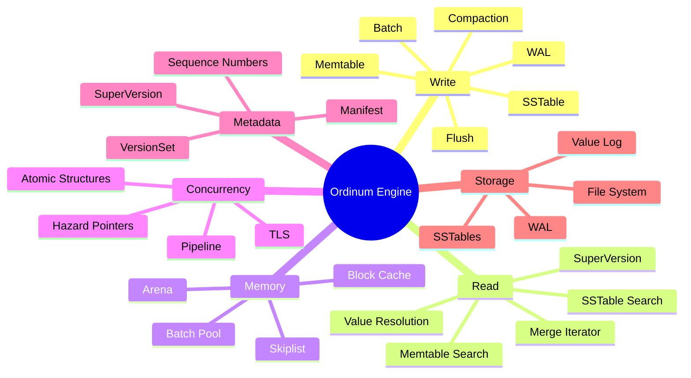
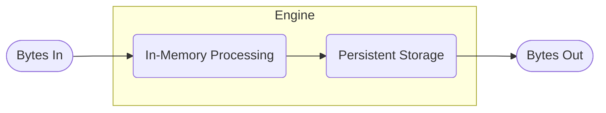
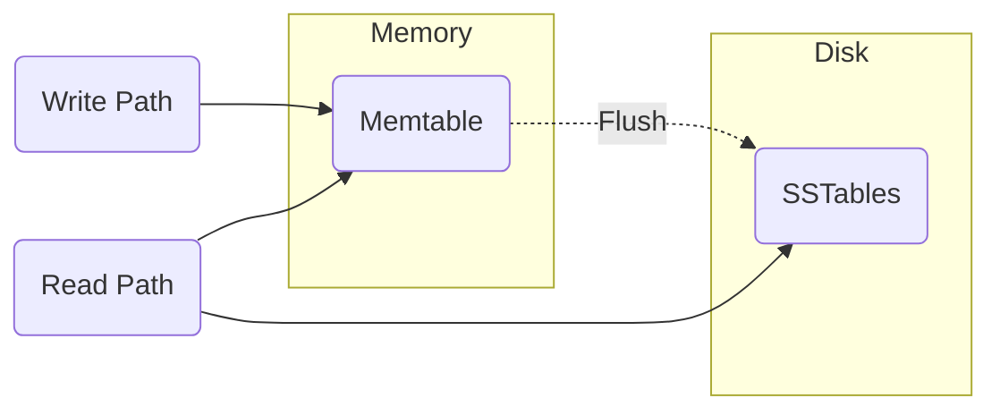
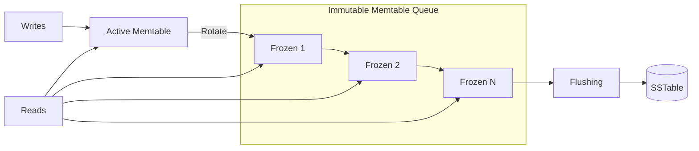
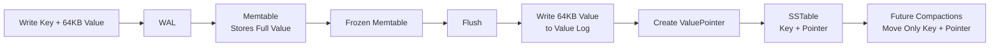
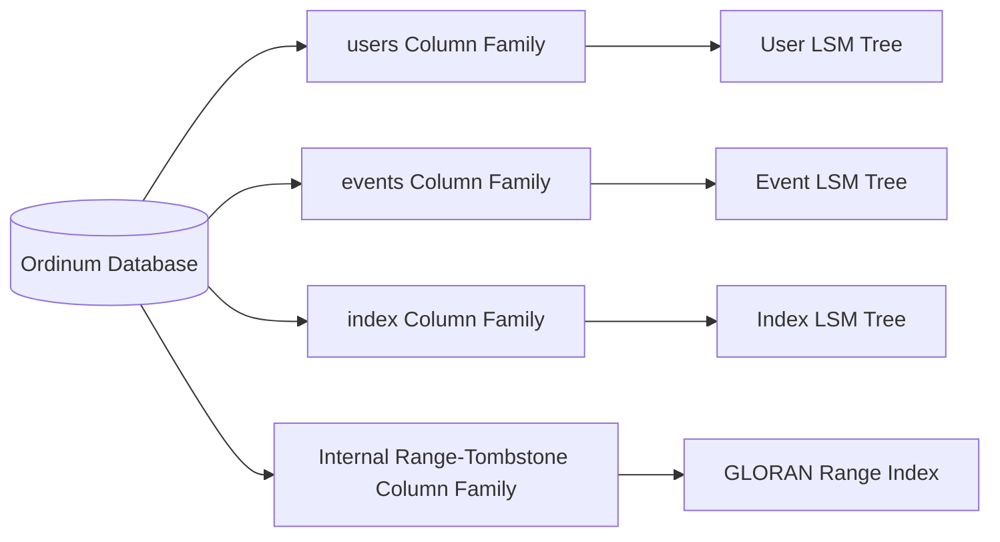

# Ordinum

A Log-Structured-Merge Tree (LSM) Database Storage Engine

---


### So, what is it?

Ordinum is a database storage engine built from scratch in Rust. It is based on the log-structured-merge tree architecture popularised by systems such as **Google [(LevelDB)](https://en.wikipedia.org/wiki/LevelDB)**, **Facebook [(RocksDB)](https://rocksdb.org/)**, and **Cockroach Labs [(PebbleDB)](https://www.cockroachlabs.com/blog/pebble-rocksdb-kv-store/)**.

The design itself was originally described in the well-known paper [The Log-Structured-Merge Tree](https://www.cs.umb.edu/~poneil/lsmtree.pdf).

> Before giving an overview, I encourage further reading on this interesting area of database design, specifically the research done around the design principles and decisions that make this architecture so different from the traditional b-tree structures widely used by relational databases.

At a high level, an LSM tree is designed around a simple idea: writes should be cheap, ordered, and durable before the system spends effort reorganising them. Instead of seeking around disk to update records in place, new changes are appended sequentially, usually to a write-ahead log, and then inserted into an in-memory structure. Over time, those in-memory writes are flushed to disk and merged into larger sorted files.

This is one of the main reasons LSM-based engines are known for fast write performance. Sequential writes are friendlier to storage devices than scattered random updates: on spinning disks they avoid costly seeks, and on SSDs they align better with batching, buffering, and flash page/block behavior.

That write path also creates an interesting engineering tradeoff. The engine accepts that data may exist in several places at once: in memory, in the log, and in immutable on-disk files. Reads therefore need to know how to find the newest version of a key, while background work gradually merges and discards older versions. The storage engine becomes a coordination layer between append-only durability, sorted structures, and cleanup.

This is where **Ordinum** fits in. The goal is not just to wrap an existing database API, but to build a storage-engine-first database from first principles. Ordinum follows the LSM model because it gives a clear foundation for exploring the core parts of a modern key-value store: write-ahead logging, memtables, sorted string tables, sequence numbers, tombstones, compaction, and eventually read/write correctness under realistic workloads.

The Ordinum storage engine works purely on bytes, with little to no semantic understanding of the data being persisted. This is its strength.

> Bytes In -->-- [Engine] -->-- Bytes Out

Rust aligns well with this kind of system. A storage engine spends a lot of time managing bytes, files, indexes, buffers, and ownership boundaries. Rust gives Ordinum low-level control without giving up memory safety, and its type system helps make state transitions explicit: data moves from log to memory, from memory to disk, and from many files into fewer compacted files.

#### The Log Structure

The "log" part of an LSM tree is about how changes enter the system. When a key is written, the engine does not immediately search through an on-disk page and mutate it in place. Instead, it appends a new record to the end of a log.

That append is important. Writing to the end of a file is predictable and efficient: the engine can keep moving forward, adding one entry after another, rather than constantly jumping around storage to update existing records. Each entry can be treated as a fact: at sequence number `N`, this key had this value.

For a simplified write, Ordinum's storage path looks something like this:

1. A write arrives as bytes for a key and value.
2. The engine assigns the write a new sequence number.
3. The record is appended to the write-ahead log so it can be recovered after a crash.
4. The same key/value pair is inserted into an in-memory sorted structure, usually called a memtable.
5. When the memtable grows large enough, it is flushed to disk as an immutable sorted file.

Because each update is appended as a new fact, the latest value is determined by the highest sequence number for that key. Older values remain physically present until the engine has enough information to safely remove them.

**Example:**

| Key | Value | Seq No. | State |
| --- | --- | ---: | --- |
| Bob | bob.bobby@gmail.com | 1 | Old |
| Bob | bob.bobson@gmail.com | 2 | Old |
| Bob | bob.just.bob@gmail.com | 3 | Old |
| Bob | bob_the_blob@yahoo.com | 4 | Newest |

This is clearly a contrived explanation of the log structure, but it illustrates the important point: the engine does not overwrite Bob's previous email addresses in place. It appends newer facts and uses sequence numbers to decide which value is currently visible.

Now, you must be thinking, '__that's great, but won't we end up with loads of garbage data?__' - Yes! and this brings us to the second part of the LSM... **the Tree.**

#### The Tree

In any database, we will inevitably build up some form of garbage data. In B-tree-based databases, the garbage is less about the data itself and more about redundant space in pages caused by in-place updates, page splits, or maintaining multi-version concurrency control (MVCC). PostgreSQL calls this [vacuuming](https://www.snowflake.com/en/blog/engineering/tuning-postgres-vacuum/). For an LSM tree, we build up garbage by appending new changes for previously written data without overwriting the old data.

The tree part of the design is how the engine brings order back to those appended writes. Once in-memory data is flushed to disk, it becomes an immutable sorted file. Over time, the engine merges these files together in a process called compaction.

Compaction is where the LSM tree pays back some of the work it deferred during writes. During a compaction, the engine reads multiple sorted files, merges their key ranges, keeps the newest version of each key, and drops entries that are no longer needed. If a key was deleted, the engine may write a tombstone first, then later remove both the tombstone and the older values once it is safe to do so.

This gives the engine a useful tradeoff: writes stay fast because they are mostly append-only, while cleanup happens later in larger sequential batches. The cost does not disappear, but it is moved into background work that can be scheduled, throttled, and tuned.

#### The Levels

The "tree" in an LSM tree is usually represented as a set of levels. Each level contains sorted immutable files, often called SSTables. New data starts near the top of the tree, and as compaction runs, data is gradually pushed down into lower levels.

A simplified level layout looks like this:

| Level | Contents | Role |
| --- | --- | --- |
| Memtable | Recent writes in memory | Fast reads and writes before flushing |
| Level 0 | Newly flushed sorted files | First durable on-disk level |
| Level 1+ | Larger compacted sorted files | Older, more organised data |

Lower levels are usually larger and more stable. They contain data that has already been compacted, so there should be less duplication and fewer obsolete versions. Reads may need to check multiple places, starting with the memtable and moving down through the levels until the newest matching key is found.

This levelled structure is what keeps the append-only write model practical. Without it, the engine would keep accumulating old versions forever. With levels and compaction, Ordinum can accept writes quickly, preserve durability through the log, and gradually organise the data into sorted files that are efficient to search and merge.

All of this combines to create an elegant system designed for simplicity and built for speed.

These are the principles Ordinum endeavours to capture and harness, which brings us to the next section.

### Why Ordinum?

>The purpose of **Ordinum** is to be a storage-engine-first database: simple in design, reliable in persistence, and fast by construction.

Ordinum exists to make the core mechanics of database storage explicit. It does not start with a query language, a distributed protocol, or a large feature surface. It starts with the foundation: bytes written to disk, recovered after failure, organised into sorted structures, and compacted over time into a durable key-value store.

Once we get that right, building from that strong foundation becomes easier and an entirely better experience. Knowing and owning our internals is crucial and a pillar to this project.

That focus matters. A database is only as strong as its storage engine. If writes are not durable, reads are not correct, deletes are not handled carefully, or compaction corrupts state, every layer above it becomes meaningless. Ordinum treats the storage engine as the product, not an implementation detail.

The project is built around a few clear principles:

- **Storage first**: persistence, recovery, indexing, and compaction are the centre of the system.
- **Correctness before complexity**: the engine should be understandable before it becomes clever.
- **Append first, organise later**: writes should be cheap and sequential, with structure restored through flushing and compaction.
- **Bytes in, bytes out**: the engine stores data without needing to understand application-level meaning.
- **Rust-native reliability**: ownership, types, and explicit state transitions should help enforce the shape of the system.

Ordinum is not trying to hide the hard parts of database engineering. It is trying to expose them, implement them, and make them understandable. Its purpose is to grow into a database engine that stays true to the LSM model: durable writes, ordered data, deliberate compaction, and a design that remains small enough to reason about as it becomes more capable.

There is the sales pitch. In fact, it's much more a mantra than a pitch and even less about sales.

Ordinum is a passion project originally started as a means to build a deeper knowledge of database internals, and to explore a love for low-level system design.

Ordinum's storage engine is, and always will be, open source. In the spirit of not reinventing the wheel, it is inspired by systems such as **RocksDB**, **LevelDB**, and **PebbleDB**, as well as key research papers. This leaves room to iterate and improve where appropriate.

You may be asking, 'What makes Ordinum different?' or 'Why another database?' and honestly, I wish I had a better answer than that we hope to take something incredibly complex by design and make it beautifully simple. That the innovation is taking years worth of iteration and many different implementations and condensing that into one focused application with proven efficiency.

And on that, it is worth maybe talking about the architecture of Ordinum and some of the design decisions.

### Architecture and Design



Ordinum follows the LSM structure as a whole. At a high level, the engine has two stages: in-memory processing and persistent storage.




This is, of course, a highly simplified model. Each stage has its own subsystems and constraints, which must ultimately be woven together to move bytes from ingestion, through persistence, and back into reads.

Many of these subsystems are what give an LSM database its character. Writes do not immediately become sorted files on disk. They first pass through an in-memory write path, where they may be batched, assigned sequence numbers, written to the WAL, and inserted into mutable in-memory structures. In Ordinum, this means thinking carefully about how batches move through the pipeline, how ordering is preserved, and how multiple writer threads can safely apply their work concurrently.

The memtable is one of the most important pieces of this stage. It acts as the first searchable home for newly written keys, while also buffering writes before they are flushed into immutable on-disk tables. A structure such as a skip list is a natural fit because it maintains sorted order while supporting efficient inserts and lookups. The interesting part is not simply choosing a skip list, but making it work safely under concurrency: allocating nodes, publishing links, handling retries, and ensuring readers never observe partially installed state.

Once the memtable reaches a threshold, the problem changes shape. The in-memory structure must become immutable, handed off for flushing, and eventually encoded into SSTables on disk. At that point, the engine shifts from fast concurrent mutation to careful persistence: block layout, indexes, filters, checksums, compression, and metadata all become part of the story.

Reads then have to stitch these worlds back together. A lookup may need to consult the current memtable, immutable memtables waiting to be flushed, and several levels of SSTables. The engine must make this feel like one coherent view of the database, even though the data is physically spread across memory and disk, and may exist in multiple versions due to updates, deletes, and snapshots.

So while the simplified model is “bytes in, bytes persisted, bytes out,” the real design is about coordinating many smaller systems: the write pipeline, WAL, memtables, flushes, SSTables, version management, snapshots, iterators, and compaction. The strength of an LSM engine comes from how cleanly these pieces are connected.

A slightly more accurate high-level picture represents the two caller paths, `Writer` and `Reader`, and shows how they flow through the two stages.




Traditionally, the in-memory part of an engine would have a single active memtable and a single frozen memtable. When the active memtable becomes full, it is frozen, a fresh memtable becomes active, and the frozen memtable is flushed to disk in the background.

Like RocksDB, Ordinum allows multiple frozen memtables up to a configured limit. This avoids stalling rotations while a previous memtable is still flushing, which is particularly useful under sustained write workloads that cause frequent memtable churn. Writes and reads can continue to use the in-memory portion of the engine while background threads flush the immutable queue.




Ordinum draws on established LSM implementations and academic research to create a robust, understandable storage engine. Another design choice that informs the architecture is the separation of keys and values.

#### Key-Value Separation

The paper [WiscKey: Separating Keys from Values
in SSD-conscious Storage](https://www.usenix.org/system/files/conference/fast16/fast16-papers-lu.pdf) details the optimisations that come with separating large values from keys when storing bytes.

Typically, standard storage engines store the key and value inline together, carrying both through the write path until they are persisted on disk as one contiguous record. This works well for small values: the engine finds the latest visible key in the LSM tree and the value is stored alongside it.

For large values, the traditional LSM design begins to suffer from significant write amplification. Every time a value moves through the compaction hierarchy, the entire key-value pair must be rewritten. A 32-byte key with a 4 KB value is treated as a 4 KB record, meaning compactions repeatedly read and rewrite large quantities of data even though the expensive portion is rarely used for ordering or searching.

The key observation made by WiscKey is that the LSM tree primarily exists to organise keys. During a lookup, the engine searches for a key and only needs the associated value once the latest visible version has been located. Storing large values inline therefore causes the LSM to perform work that is unrelated to its core purpose.

To address this, WiscKey separates keys from values. Values are written to an append-only Value Log while the LSM tree stores only the key and a small pointer describing where the value resides within the log. This pointer typically contains a file identifier, offset and length.

Pure WiscKey creates the value pointer during the write path and only inserts the pointer into the memtable. Ordinum's design is closer to Pebble/RocksDB in that the memtable remains a complete representation of recently written data. Every write enters the WAL and memtable as a normal key-value pair, allowing reads from active and frozen memtables without ever touching the Value Log.

Only when a memtable is flushed does Ordinum decide whether a value should remain inline or be separated. During flush, values larger than a configured threshold are written to the value log and replaced with a value pointer in the generated SSTable. Smaller values continue to be embedded directly within the SSTable.

This preserves the simplicity and performance of the write path. Memtable inserts remain a single operation, readers can access recent writes directly from memory, and value separation becomes a storage-level optimisation rather than a write-path concern.

The trade-off is that the flush process becomes slightly more expensive, as it must decide how each value should be encoded and potentially append large values to the Value Log. In return, the LSM tree benefits from reduced compaction costs once data reaches disk.



> Unlike WiscKey, Ordinum does not separate values during the write path. All writes are stored in the WAL and memtables as complete key-value pairs. Value separation occurs only during memtable flush, where large values are redirected into the value log and replaced with compact value pointers in SSTables. This preserves fast in-memory reads while still achieving the reduced write-amplification benefits of key-value separation for persisted data.

#### Write Pipeline

The write pipeline accepts concurrent writes, groups compatible work into batches, and queues those batches for commit. Batching is a common storage-engine optimisation because it amortises coordination and durability costs across several writers.

The key idea is that several writer threads can share a commit and, where the durability policy requires it, a single `fsync` of the write-ahead log. This reduces system-call overhead and the amount of coordination each writer performs. The result is higher write throughput without weakening ordering or durability guarantees.

For example:

If we have 5 threads trying to write at the same time, without batching we could see something like the table below:

| Thread | Fsync Time |
| - | - |
| Thread A | 3ms |
| Thread B | 3ms |
| Thread C | 1ms |
| Thread D | 2ms |
| Thread E | 1ms |
| **Total**| **11ms** |

Again, this is contrived, but the principle is realistic. If every writer independently synchronises the WAL, the engine can spend substantial time waiting for durability barriers before considering the other work required to commit a write.

You may rightly ask whether writes can simply be performed in parallel. The answer is partly yes. The WAL must maintain a global sequence order, and readers must not observe a newer write before an earlier write that precedes it in that order. However, once ordering has been established, parts of the work, such as applying independent batches to memtables, can proceed concurrently. Publication still preserves the original sequence order.

So what does a batched example look like?

| Write Batch | Fsync Time |
| - | - |
| Write Batch (5 Threads) | 3ms |

Much simpler and much faster.

RocksDB and Pebble use different write-group and commit designs. Ordinum takes inspiration from both to form a fast, efficient basis for its write pipeline. This topic deserves its own journal entry, but it remains one of the key architectural decisions and is worth highlighting here.

#### Version Management

Version management gives readers a stable view of the database while writers flush memtables, install SSTables, and run compactions. A read should not need to understand every concurrent change taking place beneath it; it should see one coherent set of memory tables and on-disk files.

Ordinum uses versioned state to represent that coherent view. The design includes per-thread caches of the current SuperVersion, so the read path can reuse stable metadata instead of reconstructing it for every lookup. When writers install new state, readers can continue using the older version until they are finished, after which obsolete state can be retired safely.

The SuperVersion is the reader's entry point into the engine. It captures the active memtable, the immutable memtables waiting to flush, and the current on-disk version metadata. A lookup can use that snapshot to search memory and SSTables consistently, even while another thread rotates a memtable or installs the result of a compaction. The next read can then pick up the newer SuperVersion without invalidating the previous reader's view.

To support this efficiently, Ordinum uses a custom thread-local-storage matrix. Each thread owns a row of local state, with a vector of entries. Each entry forms a column of subsystems, each identified by its own `tls_id`. This gives the read path a place to cache per-database SuperVersion state without turning the cache into a global lock or assuming that the process has only one database instance. Writers can publish newer versions while readers continue to use their protected cached view; hazard-pointer-style reclamation is being explored to make the retirement boundary explicit and safe.

#### Column Families and Range Deletion

Column families are more than namespaces. They let one Ordinum database host several independent LSM trees, each with its own memtables, SSTables, compaction lifecycle, and options. A database can keep user profiles, an event stream, and an application index together without forcing those workloads through one shared write buffer or one compaction policy.



This matters when the data has different shapes. A small `users` column family might favour low-latency point lookups, while an `events` column family may absorb a high write rate and retain data for a shorter period. Column families let those choices remain local to the data that needs them rather than becoming global compromises for the whole database.

They also provide a natural home for range deletion. Rather than deleting keys one by one, a range tombstone records that a span of keys is no longer visible from a particular sequence number. For example, deleting an expired time range can be represented as one logical operation rather than millions of point deletes:

```text
delete [events/2024-01-01, events/2024-02-01)
```

Reads and compactions must account for that tombstone until it is safe to remove both the tombstone and the covered data. Ordinum's range-deletion design takes direction from the GLORAN paper and its indexing approach for range tombstones. A dedicated internal column family gives that index its own sorted LSM structure, keeping range-delete metadata organised instead of making every point lookup scan an unstructured collection of intervals.

The result is a database that can expose straightforward logical key spaces to applications while using specialised internal structures where the storage engine needs them. Range deletion is one example; the broader principle is that column families give Ordinum room to add focused subsystems without turning the main LSM tree into a single overloaded structure.

#### SSTables and Persistence

When an immutable memtable is flushed, Ordinum writes a sorted string table, or SSTable. An SSTable is an immutable on-disk file containing sorted key-value entries alongside the metadata needed to search it efficiently. Data blocks, indexes, filters, checksums, and optional compression keep the file both searchable and verifiable without treating the whole file as one large record.

The persistent layer is deliberately conventional: durable append-only logs for recovery, immutable sorted files for long-term data, and metadata describing which files form the current database version. The interesting work is in preserving those invariants while files are created, compacted, installed, and eventually retired.

That conventional shape is intentional. Ordinum does not need a novel file format to be useful; it needs a persistence layer that is correct, auditable, and efficient. The goal is to follow proven storage-engine patterns while expressing ownership, error handling, state transitions, and concurrent access in Rust-native terms. Rust should help make unsafe boundaries small and explicit, without getting in the way of predictable IO and fast byte-oriented code.

#### Compaction Policy

Compaction decides when overlapping files should be merged and how data should move through the levels. Its job is to control duplication, reclaim space from overwritten or deleted values, and keep reads from checking an ever-growing number of files.

Ordinum aims to keep this policy understandable: a small set of level-size and backlog thresholds should trigger predictable background work, while write stalls protect the system if compaction cannot keep up. The exact tuning is an implementation detail; the principle is that background maintenance must preserve correctness without making foreground writes unpredictable.

### Closing

There are many more decisions behind Ordinum than can fit into one overview: recovery, block formats, filters, iterators, snapshot semantics, compaction scheduling, range deletion, value-log reclamation, and the details of concurrent memory management. Those topics will be explored in separate design journals as the engine develops.

Ordinum is on a journey to build a storage engine from durable, ordered bytes upward: one that makes its coordination boundaries explicit, adopts proven ideas where they fit, and uses Rust to keep the implementation safe and fast. The goal is not to claim that LSM databases are simple, but to make their complexity visible, testable, and earned one subsystem at a time.
